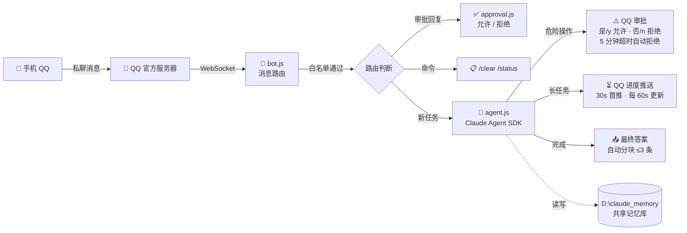

<p align="center">
  <h1 align="center">🔗 QQ-Claude</h1>
  <p align="center"><strong>📱 手机 QQ 上的 Claude Code — 用 QQ 操控你的电脑</strong></p>
  <p align="center">一条 QQ 消息，让 Claude Code 在你的电脑上执行任何操作。</p>
</p>

<p align="center">
  
  
  
  <br>
  <sub>Created by <a href="https://github.com/liuxiaoguo086-hub">liuxiaoguo086-hub</a> · Powered by <a href="https://www.npmjs.com/package/@anthropic-ai/claude-agent-sdk">Claude Agent SDK</a> · Messaging by <a href="https://q.qq.com/">QQ 开放平台</a></sub>
</p>

---

## 📖 目录

- [这是什么](#-这是什么)
- [核心理念](#-核心理念)
- [架构](#-架构)
- [功能详解](#-功能详解)
- [项目结构](#-项目结构)
- [快速开始](#-快速开始)
  - [1. 注册 QQ 开放平台 Bot](#1-注册-qq-开放平台-bot)
  - [2. 环境准备](#2-环境准备)
  - [3. 安装与配置](#3-安装与配置)
  - [4. 运行](#4-运行)
- [配置参考](#-配置参考)
- [使用示例](#-使用示例)
- [与同类项目比较](#-与同类项目比较)
- [常见问题](#-常见问题)
- [安全](#-安全)
- [License](#license)

---

## 💡 这是什么

**QQ-Claude** 基于 [Claude Agent SDK](https://docs.anthropic.com/en/docs/claude-code/agent-sdk) 运行一个完整的 Claude Code 实例，入口从终端换成了 QQ。你在手机 QQ 上给 Bot 发私聊，Claude 直接在你的电脑上执行操作，结果返回手机。

> 与桌面终端 Claude Code 共享同一套 SDK、同一套工具集和同一份记忆库，两端能力一致。

---

## 🧠 核心理念

```
┌──────────────────────────────────────────────────┐
│                                                  │
│   QQ-Claude 是一个完整的 Claude Code 实例          │
│                                                  │
│   入口: QQ 消息                                   │
│   大脑: Claude Agent SDK + AI 模型                 │
│   工具: 完整工具集（读写、编辑、Git、命令执行等）     │
│   审批: QQ 消息实时批准/拒绝                       │
│   记忆: 与桌面终端共享 D:\claude_memory            │
│   扩展: Skills / MCP 可按需接入                    │
│                                                  │
│   你用 QQ，它就在 QQ 里干活；                      │
│   你坐终端前，它就在终端里干活。                     │
│   同一份能力，你选方便的入口。                       │
│                                                  │
└──────────────────────────────────────────────────┘
```

---

## 🏗 架构



### 消息路由顺序

每条 QQ 私聊消息按以下优先级处理：

```
1. 白名单检查    → 不在名单？忽略
2. 审批回复      → 有挂起的审批？解析 是/否
3. 内建命令      → /clear /status /help
4. 任务互斥      → 有任务在跑？提示等待
5. 新任务        → 启动 Claude Code 会话
```

---

## ✨ 功能详解

### ⚠️ 危险操作审批

Claude Code 在执行 **写文件、编辑、删除、执行非只读 Bash** 等操作前，会先通过 QQ 发一条审批请求给你：

```
⚠️ 权限请求
工具: Bash
命令: rm "C:/Users/20195/Desktop/test-bridge.txt"
回复 是/y 允许，否/n 拒绝（5 分钟未回复自动拒绝）
```

- 回复 **`是`** / **`y`** / **`允许`** → 操作放行，任务继续
- 回复 **`否`** / **`n`** / **`拒绝`** → 操作被拒，Claude 获知原因后尝试其他方案或汇报无法完成
- **5 分钟不回** → 自动拒绝，任务不卡死
- **只读操作不弹审批**：读文件、搜索、列出目录、curl/wget 拉取、git log/diff 等自动放行（完整白名单见 [配置参考](#-配置参考)）

### ⏳ 长任务进度推送

任务超过 30 秒时，每 60 秒自动推送一条当前状态：

```
⏳ 正在执行: 执行命令 npm install（已运行 65 秒）
⏳ 正在执行: 写入 D:\project\app.js（已运行 130 秒）
```

- 审批挂起期间暂停推送（审批消息本身已经说明了当前状态）
- 进度消息不占用最终答案的发送配额
- 可通过 `progress` 配置项开关或调整频率

### 💾 记忆库共享

与桌面 Claude Code 共享 **同一个** `D:\claude_memory` 目录。QQ 端产生的记忆文件桌面端可见，反之亦然。这意味着：

- 你在手机上让 Claude 查到的信息会被记住
- 坐回电脑前用 `claude` 时，它能读到之前手机上对话的上下文
- 两端通过 `MEMORY.md` 索引感知彼此的存在

### 🔄 连续对话

基于 Agent SDK 的 session resume：第二条消息自动接续上次会话，Claude 记得之前的对话内容。会话 ID 持久化在 `D:\claude_memory\data\qq-bridge-sessions.json`，重启不丢失。`/clear` 可随时重置。

---

## 📁 项目结构

```
qq-claude/
├── index.js              # 入口点：daemon / status / stop 生命周期
├── start.bat             # 启动脚本（在此填入 API Key）
├── package.json          # qq-official-bot + @anthropic-ai/claude-agent-sdk
├── data/
│   └── config.json       # QQ Bot 凭据、模型、权限白名单、进度推送参数
├── src/
│   ├── agent.js          # Claude Code 后端：SDK query()、会话管理、进度跟踪
│   ├── approval.js       # QQ 审批：canUseTool → 审批消息 → 用户反馈
│   ├── reply-channel.js  # 回复通道：被动预算管理、分块、主动推送降级
│   ├── bot.js            # QQ Bot：WebSocket 连接、消息路由、白名单
│   ├── config.js         # 配置：defaults < config.json < env 三级合并
│   ├── store.js          # 持久化：session 映射、交换日志、记忆摘要
│   └── logger.js         # 日志：本地时间戳、终端 + 文件双输出
└── logs/                 # 运行日志（运行时生成）
```

---

## 🚀 快速开始

### 1. 注册 QQ 开放平台 Bot

> 📌 前往 [**q.qq.com/qqbot**](https://q.qq.com/qqbot)

**沙箱模式（推荐先用沙箱测试）：**

1. 登录后点击「创建机器人」
2. 填好名称、简介、头像，创建完成
3. 进入「开发设置」→ 获取 **AppID** 和 **AppSecret**
4. **不要发布上线**，直接用沙箱模式 → 用手机 QQ 扫码添加你的 Bot
5. 沙箱模式下没有频控限制，适合个人使用

> ⚠️ 沙箱 Bot 只能私聊，不能加群。这也正是本项目的使用场景。

### 2. 环境准备

| 依赖 | 版本/路径 | 说明 |
|---|---|---|
| **Node.js** | ≥ 22 | [nodejs.org](https://nodejs.org/) |
| **Git Bash** | `D:\Git\bin\bash.exe` | Claude Code Bash 工具依赖（[git-scm.com](https://git-scm.com/)） |
| **QQ Bot 凭据** | AppID + AppSecret | 从 [q.qq.com/qqbot](https://q.qq.com/qqbot) 获取 |
| **API Key** | DeepSeek 或 Anthropic | [platform.deepseek.com](https://platform.deepseek.com/api_keys) 或 [console.anthropic.com](https://console.anthropic.com/) |

> 💡 如果你用 Anthropic 官方 API，只需把 `baseUrl` 改回 `https://api.anthropic.com` 并把 `model` 改成 `claude-sonnet-5-20250901` 等。任何 Anthropic 兼容端点都可以。

### 3. 安装与配置

```bash
# 克隆
git clone https://github.com/你的用户名/qq-claude.git
cd qq-claude

# 安装依赖
npm install
```

**配置三步走：**

<details>
<summary><b>① 编辑 <code>start.bat</code> — 填入 API Key</b></summary>

```bat
set "ANTHROPIC_AUTH_TOKEN=sk-你的Key"
```

</details>

<details>
<summary><b>② 编辑 <code>data/config.json</code> — 填入 QQ Bot 凭据</b></summary>

```json
{
  "qq": {
    "appId": "你的AppID",
    "appSecret": "你的AppSecret",
    "sandbox": true
  }
}
```

</details>

<details>
<summary><b>③ 设置白名单（强烈建议）</b></summary>

1. 先不设白名单（`allowedUsers: []`），前台启动 `node index.js`
2. 用手机 QQ 给 Bot 发一条消息
3. 看终端日���中的 `from=` 后面的 openid（格式如 `98A4B0F6A65F370747BF0A3A86C82327`）
4. 把这个 openid 填入 `security.allowedUsers`
5. 重启

</details>

### 4. 运行

```bash
# 前台运行（调试用，实时看日志）
node index.js

# 后台运行（生产用）
start.bat
# 或
node index.js --daemon

# 查看状态
node index.js --status

# 停止
node index.js --stop
```

启动成功后会看到：
```
╔══════════════════════════════════════╗
║  QQ → Claude 桥接程序  v2.0.0      ║
╚══════════════════════════════════════╝
  Bot AppID: 1905207639
  Sandbox:   沙箱 ✅
  模型:   deepseek-v4-pro
  后端:   Claude Code (Agent SDK)
  ✅ QQ Bot WebSocket 已连接
  桥接程序就绪，等待 QQ 消息…
```

---

## 📋 使用示例

| 你的消息 | 会发生什么 |
|---|---|
| `看看 D:\projects 有哪些文件` | Claude 自动 `ls`，无需审批，直接返回结果 |
| `帮我在桌面创建 notes.txt，写今天的待办` | ⚠️ 弹 Write 审批 → 回 `y` → 文件创建，内容写入 |
| `删除 C:\temp\旧文件.txt` | ⚠️ 弹 Bash(rm) 审批 → 回 `n` → 删除被拒，Claude 告知你 |
| `npm install axios 并写个请求示例` | ⚠️ 弹 Bash(npm install) 审批 + Write 审批，30s 后推送进度 |
| `/status` | 查看模型、会话 ID、运行状态、记忆文件数 |
| `/clear` | 重置会话，Claude 忘记之前的对话 |
| `把这个 Python 脚本改成多线程版本` | 长任务，途中收到 `⏳ 正在执行: …` 进度更新 |

---

## ⚙ 配置参考

<details>
<summary><b>data/config.json 完整选项（点击展开）</b></summary>

```jsonc
{
  // ── QQ Bot ──
  "qq": {
    "appId": "",              // QQ 开放平台 AppID
    "appSecret": "",          // QQ 开放平台 AppSecret
    "sandbox": true           // 沙箱模式（发布上线前一定为 true）
  },

  // ── AI 后端 ──
  "claude": {
    "apiKey": "",             // 留空，通过 start.bat 环境变量注入
    "baseUrl": "https://api.deepseek.com/anthropic",
    "model": "deepseek-v4-pro"
  },

  // ── Claude Code 运行参数 ──
  "claudeCode": {
    "cwd": "D:/claude_memory",         // 工作目录（记忆库位置，resume 依赖此路径）
    "maxTurns": 50,                    // 单任务最大工具调用轮次
    "taskTimeoutMs": 1800000,          // 单任务超时 30 分钟
    "gitBashPath": "D:/Git/bin/bash.exe"
  },

  // ── 权限 ──
  "permissions": {
    "approvalTimeoutMs": 300000,       // 审批超时 5 分钟，超时自动拒绝
    "autoAllowTools": [                // 这些工具不弹审批直接执行
      "Read", "Glob", "Grep",          // 文件只读
      "TodoWrite", "Task",             // 内部管理
      "WebSearch", "WebFetch",         // 网络只读
      "Bash(ls:*)", "Bash(cat:*)",     // 安全 Bash（可追加自定义）
      "Bash(curl:*)", "Bash(wget:*)",
      "Bash(git log:*)", "Bash(git diff:*)",
      // ... 完整列表见 config.json
    ]
  },

  // ── 进度推送 ──
  "progress": {
    "enabled": true,
    "initialDelayMs": 30000,           // 30 秒后首次推送
    "intervalMs": 60000                // 之后每 60 秒一条
  },

  // ── 回复管理 ──
  "reply": {
    "budgetPerMsg": 5,                 // 每条用户消息最多被动回复数
    "windowMs": 270000,                // 被动回复窗口 4.5 分钟
    "chunkSize": 1500,                 // 长回复分块大小（字符）
    "maxChunks": 3                     // 最多分 3 条
  },

  // ── 安全 ──
  "security": {
    "allowedUsers": []                 // ⚠️ 填你的 openid！空=任何人都可操控
  },

  // ── 记忆 ──
  "memory": {
    "dir": "D:/claude_memory",        // 与桌面端 Claude Code 共享
    "saveEveryExchange": true          // 每次对话自动记录到交换日志
  }
}
```

</details>

---

## 🆚 与同类项目比较

| | **QQ-Claude** | [claude-to-im](https://github.com/Gucvii/claude-to-im-skill) | [cc-connect](https://github.com/chenhg5/cc-connect) | [HappyClaw](https://github.com/riba2534/happyclaw) |
|---|---|---|---|---|
| 语言 | Node.js | Node.js | Go | JS/TS |
| 后端驱动 | Agent SDK | Agent SDK | CLI spawn | Agent SDK |
| QQ 审批交互 | ✅ 是/否自然语言 | ⚠️ `/perm` 命令 | ✅ `/perm` 命令 | — |
| 长任务进度 | ✅ 自动节流推送 | ❌ | ❌ | ❌ |
| 记忆共享 | ✅ 同目录读写 | ❌ | ❌ | ❌ |
| QQ 群聊 | ❌ | ❌ | ✅ | ✅ |
| 多平台 | ❌ QQ only | ✅ 4 平台 | ✅ 11 平台 | ✅ 6 平台 |
| 文件数 | 7 个源文件 | Skill 插件 | Go 微服务 | 企业级 |
| 适合谁 | 只要 QQ + 要审批体验 | 要多平台 | 要群聊 + 多功能 | 要多用户 + 计费 |

---

## ❓ 常见问题

<details>
<summary><b>为什么只支持 Windows？</b></summary>
当前硬编码了 Git Bash 路径和 D:\claude_memory 目录。Mac/Linux 用户只需修改 <code>config.json</code> 中的 <code>claudeCode.cwd</code>、<code>claudeCode.gitBashPath</code>、<code>memory.dir</code> 即可运行（不需要 Git Bash，Mac/Linux 原生有 bash）。
</details>

<details>
<summary><b>能不能用 Anthropic 官方 Claude 而不是 DeepSeek？</b></summary>
可以。改两行配置：

```json
"claude": {
  "baseUrl": "https://api.anthropic.com",
  "model": "claude-sonnet-5-20250901"
}
```

然后把 <code>start.bat</code> 里的 Key 换成 Anthropic 的。
</details>

<details>
<summary><b>被动回复和主动推送有什么区别？</b></summary>

- **被动回复**：必须"回"某条用户消息，有 msg_id 关联，5 条/消息的配额、约 5 分钟窗口。稳定可靠。
- **主动推送**：随时可以发，不依赖 msg_id。但 QQ 平台对主动消息有严格配额限制，不可靠。

本项目的回复通道优先用被动回复。进度消息预算紧张时直接丢弃（主动推送配额留给审批请求和最终答案）。
</details>

<details>
<summary><b>审批太多怎么办？</b></summary>
把常用的安全命令加入 <code>permissions.autoAllowTools</code>，例如：

```json
"Bash(npm run:*)", "Bash(pip:*)", "Bash(python:*)"
```

模式匹配规则：<code>工具名(参数前缀:*)</code>。
</details>

<details>
<summary><b>支持 Skills 和 MCP 吗？</b></summary>
当前工具集覆盖了日常使用的核心能力（读写文件、执行命令、Git、搜索等）。Skills 和 MCP 服务器是 Claude Agent SDK 原生支持的，可以通过配置接入，本项目没有锁定这些能力——如有需要，后期自行配备即可。
</details>

<details>
<summary><b>为什么不用 icqq / NapCat？</b></summary>
<code>qq-official-bot</code> 是 QQ 官方 WebSocket 协议，合法合规、稳定不掉线。icqq 是模拟协议，有封号风险。如果以后需要群聊或主动推送突破限制，可以考虑 NapCat 作为补充通道。
</details>

---

## 🔒 安全

- **密钥不在代码中**：API Key 通过 `start.bat` 环境变量注入，`data/config.json` 中为空白占位。仓库中的配置文件已脱敏。
- **白名单必须设**：`security.allowedUsers` 为空 = 任何加了你 Bot 的人都能操控你的电脑。启动时会有醒目警告。
- **审批兜底**：即使白名单漏了，所有写操作仍需要你 QQ 上回复"是"才能执行。5 分钟不回复自动拒绝。
- **不加载本机 settings.json**：`settingSources: []` 确保本机 Claude Code 的宽松权限规则不会绕过 QQ 审批。
- **轮换密钥**：如果 API Key 曾出现在日志或聊天记录中，建议去平台重新生成。

---

## License

MIT © 2026
